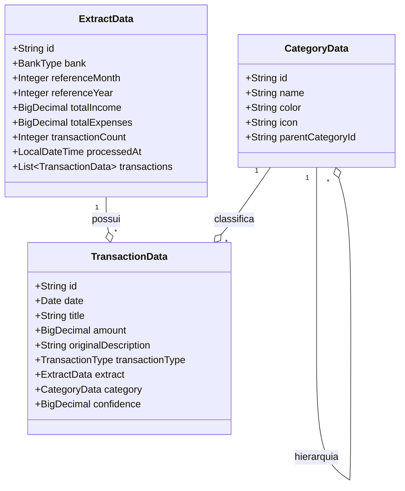

# Comunicação entre Entidades JPA

Este documento apresenta os relacionamentos entre as principais entidades JPA do projeto.

## Entidades

### TransactionData
- Representa uma transação financeira.
- Relacionamentos:
  - **ManyToOne** com ExtractData (`extract`): cada transação pertence a um extrato.
  - **ManyToOne** com CategoryData (`category`): cada transação pode estar associada a uma categoria.

### ExtractData
- Representa um extrato bancário.
- Relacionamentos:
  - **OneToMany** com TransactionData (`transactions`): um extrato possui várias transações.

### CategoryData
- Representa uma categoria de transação.
- Relacionamentos:
  - **OneToMany** implícito com TransactionData: uma categoria pode ser associada a várias transações.
  - Possui campo `parentCategoryId` para hierarquia de categorias (categoria pai).

## Diagrama de Relacionamento



## Exemplos de Selects Nativos

Abaixo estão exemplos de consultas SQL nativas que podem ser utilizadas com as entidades JPA:

### Buscar transações por extrato
```sql
SELECT * FROM transactions WHERE extract_id = :extractId;
```

### Buscar transações por categoria
```sql
SELECT * FROM transactions WHERE category_id = :categoryId;
```

### Buscar categorias filhas de uma categoria
```sql
SELECT * FROM categories WHERE parent_category_id = :parentCategoryId;
```

### Buscar extratos por mês e ano
```sql
SELECT * FROM extracts WHERE reference_month = :month AND reference_year = :year;
```

### Buscar soma de despesas por categoria
```sql
SELECT category_id, SUM(amount) FROM transactions WHERE amount > 0 GROUP BY category_id;
```

## Observações
- O relacionamento entre CategoryData e TransactionData é opcional (categoria pode ser nula).
- O campo `parentCategoryId` permite criar categorias hierárquicas.
- O relacionamento entre ExtractData e TransactionData é obrigatório.
- Os exemplos acima podem ser utilizados em métodos de repositórios usando a anotação `@Query(value = "...", nativeQuery = true)`.
- Os parâmetros devem ser substituídos conforme a necessidade da aplicação.

Este documento pode ser expandido conforme novas entidades e relacionamentos forem adicionados ao projeto.
